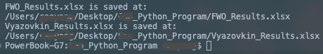
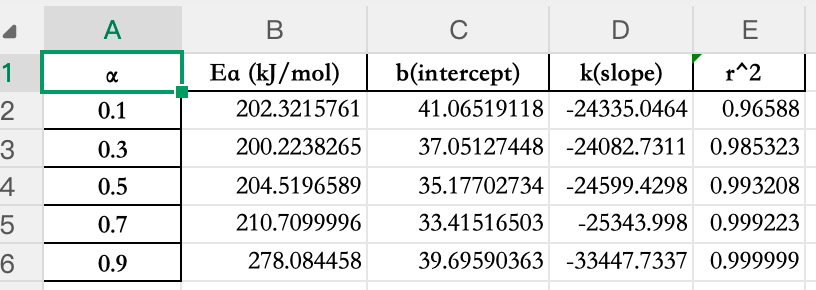
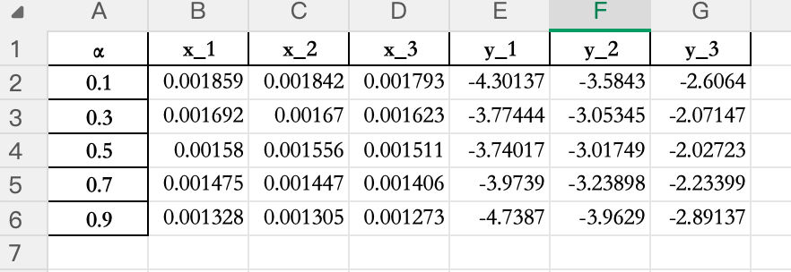
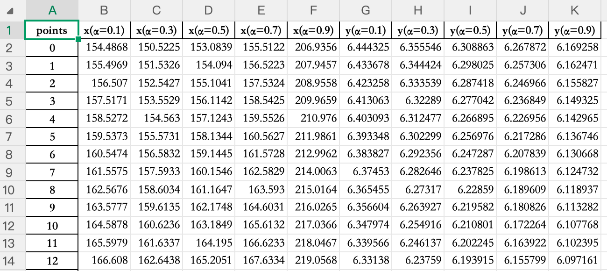
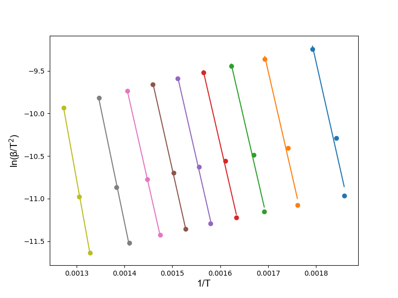
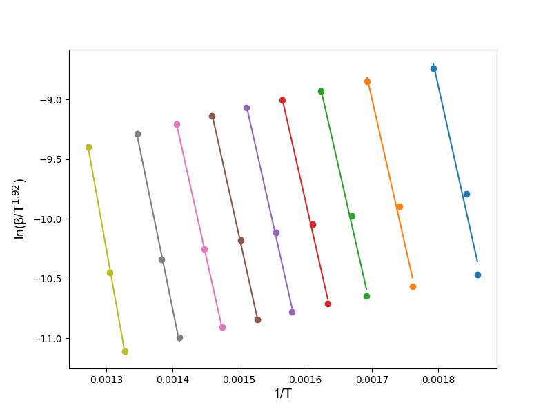
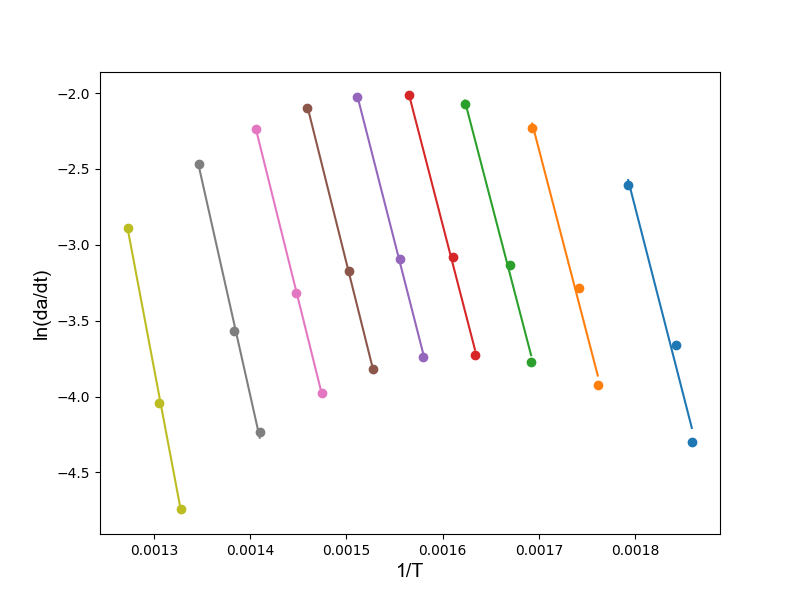
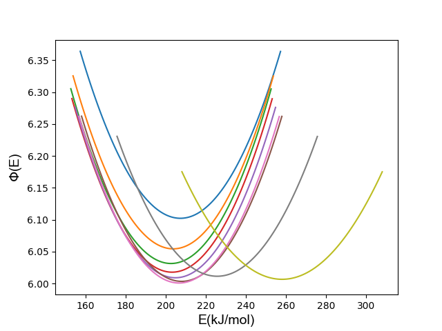

# ThermoHi
_A lightweight Python toolkit for thermal kinetics data analysis and visualization._

[](https://pypi.org/project/thermohipy/)
[](LICENSE)
[]

---

## 📖 Introduction

**ThermoHi(`thermohipy`)** is a small, research-oriented Python package for thermal kinetic analysis  
and data visualization, designed for TG/DTG analysis in pyrolysis. 
It supports apparent activation energy calculation using model-free methods such as **FWO**, **KAS**, **Starink**, **Friedman**, and **Vyazovkin method**
with clean APIs and ready-to-plot results. (You can also export the data and use your own software to create the plots.)

> An example file (`example.py`) is included to illustrate the usage of ThermoHi's main functionalities.
> Supports temperature input in Celsius (°C), Fahrenheit (°F), and Kelvin (K).All values are internally converted to Kelvin.
There is no limit on the number of heating runs or conversion values; the examples include data with 3 heating rates and 5 conversion values.
Data can be exported for plotting. Note: Vyazovkin method may generate a very large amount of data.

---

## Why ThermoHi?
ThermoHi aims to automate repetitive thermal analysis tasks (e.g., activation energy estimation), allowing researchers to spend less time clicking buttons — and more time thinking, drinking coffee ☕, saving the world, or simply focusing on what truly matters.

**If ThermoHi contributes to your research, please consider citing the associated publication(s).**

🔗 The paper's link is pending update.

---

## Workflow
The core workflow of ThermoHi is:

data_object(DataList) → KineticAnalysis(alpha, data_object) → Result → plotting(export results)

where:

DataList（`<class 'list'>`）

- A list containing:
  - Temperature, T (list)
  - Heating rate, β (list)
  - dα/dT (list)


data_object(`<class 'list'>`)

- a list used for calculating multiple sets of data,

  e.g., [DataList_1, DataList_2, ..., Datalist_n]


**Note: len(alpha) = len(DataList)**


alpha(`<class 'list'>`)


- a list of conversion values(α, 0 < α < 1), e.g., [0.2, 0.4, 0.6, 0.8]


KineticAnalysis(alpha, Datalist)


- calculating activation energy, 5 mentioned model free methods were provided,


  e.g., thermohipy.KineticAnalysis(alpha, Datalist).fwo_ea(return_data = False) 


FittingPlot(alpha, Datalist, KineticAnalysis)


- optional, generate fitting plots with`matplotlib` for reference,


  e.g., thermohipy.FittingPlot(alpha, data_object, analysis).kasplot()


Result (`<class 'dict'>`)


- A dictionary containing:
  - α       : conversion value 
  - Eα      : activation energy
  - k, b    : slope and intercept of fitting curve
  - R²      : coefficient of determination

---
## Saving examples
If `save_excel=True`, the analytical results will be saved as an `.xlsx` file 
in the current working directory. The absolute file path will be printed 
in the terminal.



The structure kinetic results of FWO, KAS, Starink and Friedman method is almost the same:



and the plotting data(scatter points)



The fitting curves of Vyazovkin method:




## Plotting examples
FWO method


KAS method


Starink method



Friedman method



Vyazovkin method



## 🔬 Planned Features
Future versions of **ThermoHi** will include:

- [ ] Support for importing experimental data directly from `.csv` or `.xlsx` files (via `pandas`)
- [ ] Unified plotting style for publication-ready figures (Matplotlib themes)
- [x] Exporting results for analysis as `.xlsx`
- [ ] Directly read TG/DTG experimental data and automatically extract corresponding `(T, β, dα/dT)` values based on user-selected α

## 🚀 Quick Start
Note: the data is solely for demonstration.
```python
import thermohipy as th
alpha = [0.2, 0.4, 0.6]
beta = [1, 5, 10, 20]
t1, t2, t3 = [150, 175, 200, 210], [165, 180, 210, 220], [400, 420, 440, 445]
dadT1 = [0.004, 0.005, 0.006, 0.007]
dadT2 = [0.005, 0.006, 0.007, 0.008]
dadT3 = [0.006, 0.007, 0.008, 0.009]
data = [
    th.DataList(t1, beta, dadT1),
    th.DataList(t2, beta, dadT2, unit='c'),
    th.DataList(t3, beta, dadT3, unit='f')
]

analysis = th.KineticAnalysis(alpha, data)
result1 = analysis.fwo_ea()
print(result1)

pic1 = th.FittingPlot(alpha, data_object, analysis).kasplot()

result2 = th.ExportData(alpha, data_object, analysis).export_fwo(save_excel=True)
print(result2)
result3 = th.ExportData(alpha, data_object, analysis).export_vyazovkin(save_excel=False)
print(result3)
```

---
## 📄 License

Distributed under the **MIT License**.\
See [`LICENSE`]() for details.

##  Author

**Hikari Quicklime, Ph.D.**
Forestry Industry Researcher & Independent Developer  
[gitHub: QuicklimeHikari](https://github.com/QuicklimeHikari)

## ⚙️ Installation

```bash
pip install thermohipy
